As a tech company, you're going to need to host and version control your source code. Unless you're super weird (or have crazy requirements), you're likely to use a SaaS platform such as GitHub to do so. 

This article covers the main controls to implement on GitHub - but you'll find that most of these have equivalents on platforms such as [GitLab](https://about.gitlab.com/) or [BitBucket](https://bitbucket.org/product). 

This guide is meant for companies new to using GitHub, but the recommendations can be used for any organization using it.

### Legend

| Description                                                                                                                                                                                                    | Label |
| -------------------------------------------------------------------------------------------------------------------------------------------------------------------------------------------------------------- | ----- |
| Everyone should do this                                                                                                                                 | 🍩     |
| Slight need for increased security                                                                                                                              | 🌯     |
| For those that will operate infra supporting systems that are critical | 🌶     |
| Recommendations that require the Enterprise version | 💰 | 

## Authentication
Authentication is the lynchpin of security on SaaS applications such as GitHub. 

GitHub authentication differs to many SaaS products in one important way: accounts are global. Developers can and do carry their accounts from company to company and use them for open source projects.

### Require two-factor authentication for everyone in the organization 🍩
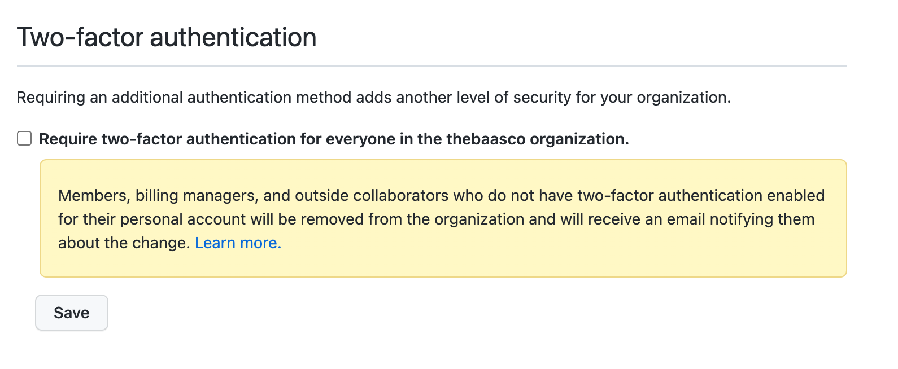

The first thing you should do to your new GitHub organization is to enable two-factor authentication. Even if you plan to use Single Sign-On (SSO) with an identity provider that requires SSO, that will protect access to your organization, but 2FA is needed to protect the user account itself.

### Single Sign-On (SSO) 🌯💰
A question I hear frequently when companies are setting up their GitHub is 
> Should we ask our employees to create new, work GitHub accounts?

The answer to that is almost always **no**, due to a simple feature. If the goal is to make sure data does not get leaked to personal GitHub accounts, it is much easier to **use SSO authentication** for access to the organization, and require an email **on your corporate domain** for notifications related to your projects.

graph LR;
id1(User)
id2(GitHub)
id3(Organization)
id4(SAML)
id5(Personal email)
id6(Work email)
id7(Personal Projects)
id3--notification-->id6
id7--notification-->id5
id1--Logs In with Account-->id2
id2-->Accesses-->id7
id2--Links to work account-->id4
id4--Accesses-->id3


That way, your corporate GitHub notifications  are accessible on work email, and GitHub sessions themselves, with SAML.

The main downside of leveraging SSO on GitHub is that the price jumps from $4 per user/month to **$21**. They're not going to give up their rankings on [sso.tax](https://sso.tax/) soon.

0. Go to the *Organization Security* settings page.
1. Enable SSO 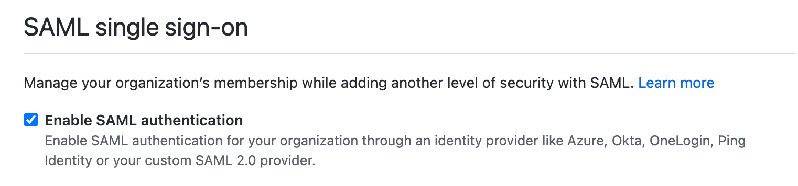
2. Require SSO 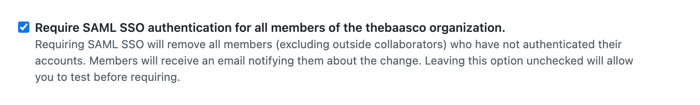
3. Go to the *Verified & approved domains* settings page
4. Verify your domain(s)
5. Require that email notifications only be sent to approved or verified domains. 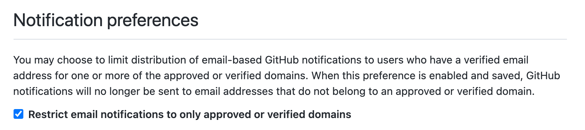

### Administrator/Owner Privileges 🌯

Keep administrator privileges to the absolute minimum. Keep in mind that anybody with owner privileges on your GitHub environment would be able to disable all the security controls discussed in this document - without being detected, unless you were using the [Audit API](https://docs.github.com/en/organizations/keeping-your-organization-secure/reviewing-the-audit-log-for-your-organization) with automated detection. 

Make sure two people are able to get to owner privileges, but no more. As you increase your security and consider becoming compliant with various frameworks, you might even have to restrict that even more, by splitting passwords and 2FA credentials between different people.

## Repositories
Repositories are the main reason organizations use GitHub. If you're not going to create them, why bother?

There are many ways to ensure the security of repositories and the code they contain. This requires controlling who is able to create and configure the repositories, then, to have a standard configuration applied to them.

### Member Repository Permissions 🌯

To keep control on the configuration of repositories, you must ensure GitHub owners are the only ones able to create them.

### Repository Creation 🌯

Under *‌Member repository permissions*, make sure you uncheck permissions for the creation of public and private repositories.

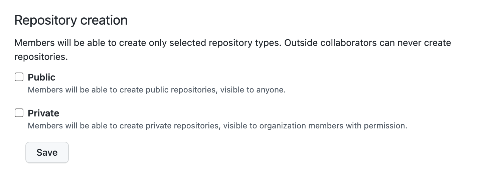

> But what if I need people to be able to create repositories? I don't want to slow them down!

That's what [automation](github_automation.md) is for!

### Repository forking 🍩 
By default, ensure public repositories are the only one that can be forked, by disabling this feature.

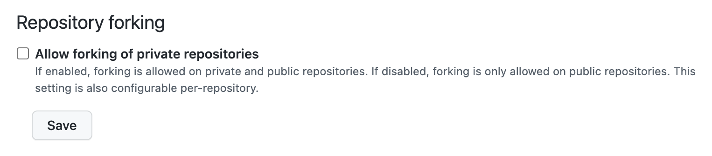

### Repository Outside collaborators 🌯

If you are using SAML, and are using that to enforce specific requirements on systems connecting to GitHub, you may want to enforce that outside collaborators not be allowed. Instead, invite consultants as regular users, but give them an account on your identity provider.

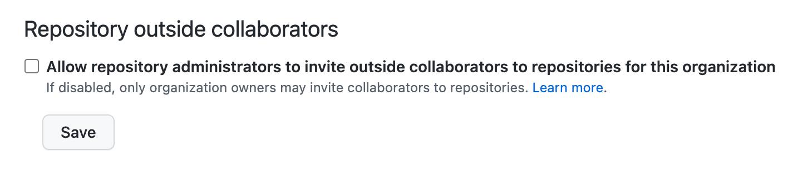

If you must collaborate with a lot of external consultants, and you do not apply specific security requirements to connecting to GitHub, then leaving this setting enabled makes sense.

### Branch Protection 🍩 

Branch protection is one of the most important settings to configure, and the main reason you should not have members with administrative privileges on the repositories.

Located in the **Branches** section of repository settings, you must create branch. 

First, ensure branch protection is enabled on at least your default branch.

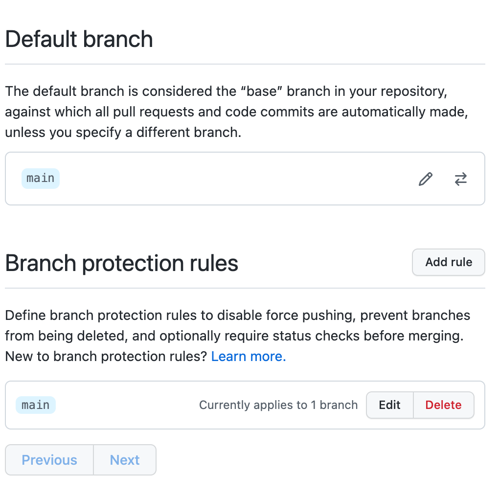

| Setting                                                          | Value     | For    | Description                                                |
| ---------------------------------------------------------------- | --------- | ------ | ---------------------------------------------------------- |
| Require a pull request before merging                            | ✅        | 🍩  | Enforce code reviews                                       |
| Require approvals                                                | 1️⃣         | 🍩  | Require at least 1 approval                                |
| Require approvals                                                | 2️⃣        | 🌶 | Require at least 2 approvals                               |
| Dismiss stale pull request approvals when new commits are pushed | ✅         | 🍩  | Invalidated existing approvals when changing code          |
| Require review from Code Owners                                  | ✅         | 🍩  | Require reviews from specific users or teams in CODEOWNERS |
| Require signed commits                                           | ✅         | 🌶 | Require GPG signing of commits                             |
| Include administrators                                           | ✅         | 🍩  | Apply rule to repository administrators and GitHub owners  |
| Allow force pushes                                               | ⛔️ | 🍩  | Self-explanatory                                           |
| Allow deletions                                                  | ⛔️ | 🍩  | Self-explanatory                                           |

Other values should be configured based on your use cases.

## Other Settings
### Pages 🌯

Ensure that regular members do not have the ability to create public pages, but can create private ones. This can prevent the accidental publishing of internal documentation.

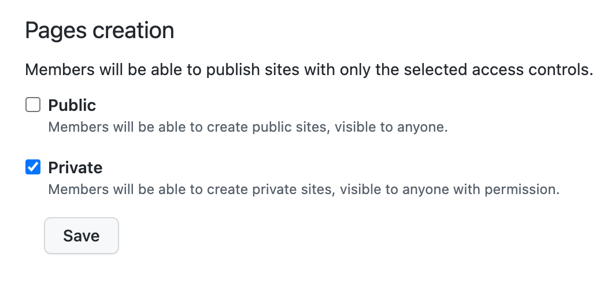

### Admin Repository Permissions 
These permissions apply to members that have admin privileges on repositories.

It is important to limit admin privileges on repositories. These privileges are simply too high to grant to multiple people, as they allow disabling security features such as branch protection. Therefore, it is important to strive for repositories without administrators, except for service accounts used for [automation](github_automation.md).

That being said, these automation accounts might be attacked, and so, it is useful to limit the privileges being made available to those accounts.

#### Repository visibility, deletion and transfer 🌯

Visibility would allow a member to make a repository public, which could result in accidental or at least, unexpected public publishing of internal repositories.

Deletion and transfer can also be dangerous, as an attacker might attempt to take control of repositories, in exchange for a ransom for example. 

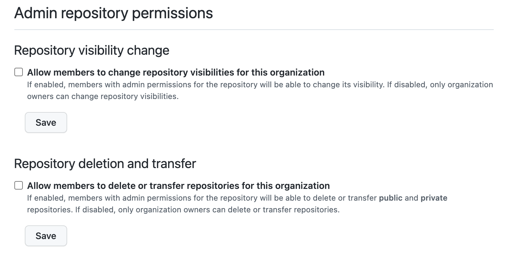

#### Member team permissions 🌯
Disable this to prevent members from creating teams, which should be managed through [automation](github_automation.md).

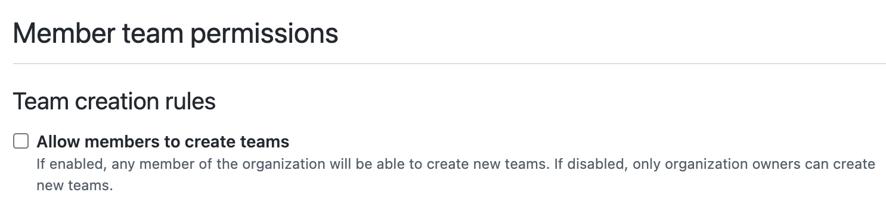

#### Member organization permissions 🍩 

Enable this to ensure everyone contributing on your repositories has access to security advisories related to dependencies of the code.

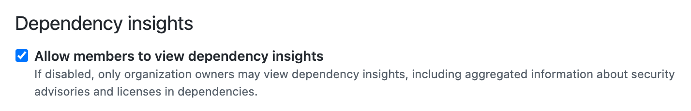

## Security & Analysis 🍩 
Depending on your GitHub subscription level, and on your repositories being public or private, you will have access to various security and analysis tools. 

I recommend that you simply enable all of them by default.

**There is no API for configuring these during repository creation, making the configuration of the defaults even more iportant**.

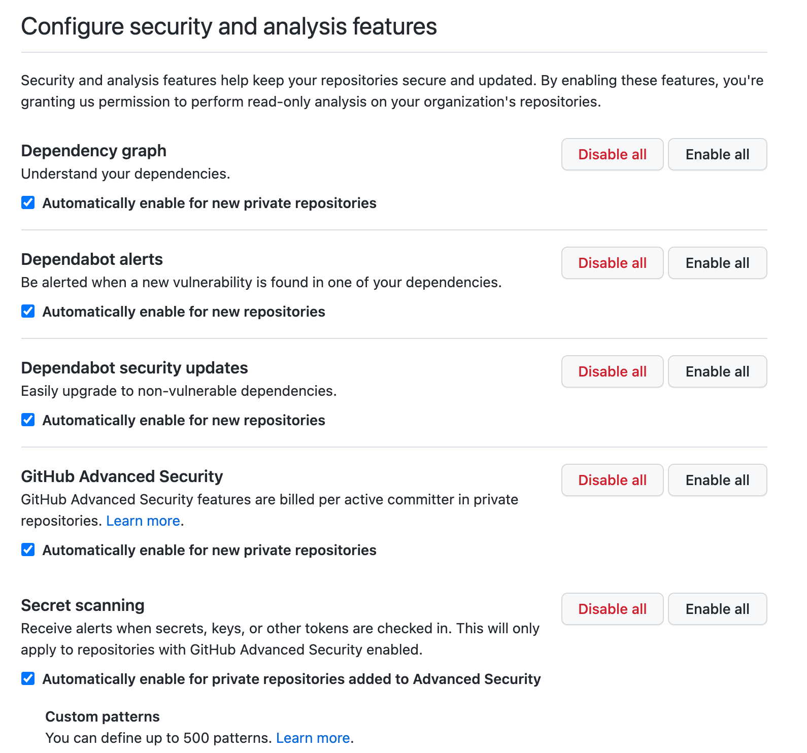

## Actions 🌯 to 🌶
GitHub actions lets you build workflows directly in GitHub. It can be used as a full-fledged CI/CD, or for simpler tasks.

Actions, by definitions, are code that is executed with permission to interact with repositories. 

If you do not use actions: block them all for now.
If you do use actions, and require a high level of security, allow specific actions only.

If you are in the middle, allow actions that are made by GitHub directly, as well as from [verified creators](https://github.com/marketplace?type=actions&verification=verified_creator).

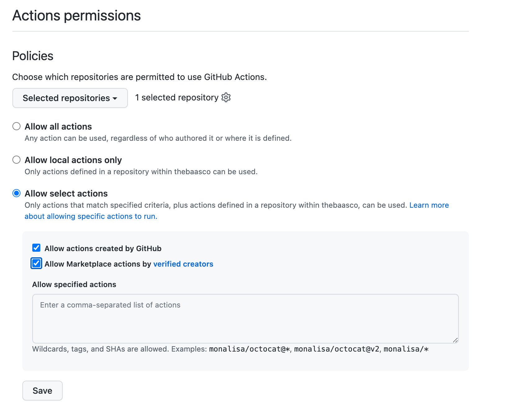

## Codespaces

[Codespaces](https://github.com/features/codespaces) is essentially ML-powered autocomplete for developers. Its name is also real close to the [name of a company that closed after getting wrecked by an attack](https://www.csoonline.com/article/2365062/code-spaces-forced-to-close-its-doors-after-security-incident.html), but it is completely unrelated.

It is essentially a development environment in the cloud for your developers, available through a browser or the desktop version of Visual Studio Code.

If you do not intend on using them, do not allow them, as they are relatively expensive. But keep in mind they exist, especially if you start thinking of ways to allow developers to work in standardized environments without having too much control on their actual computers.

## Automating 🌶 this

See [automation](github_automation.md)!