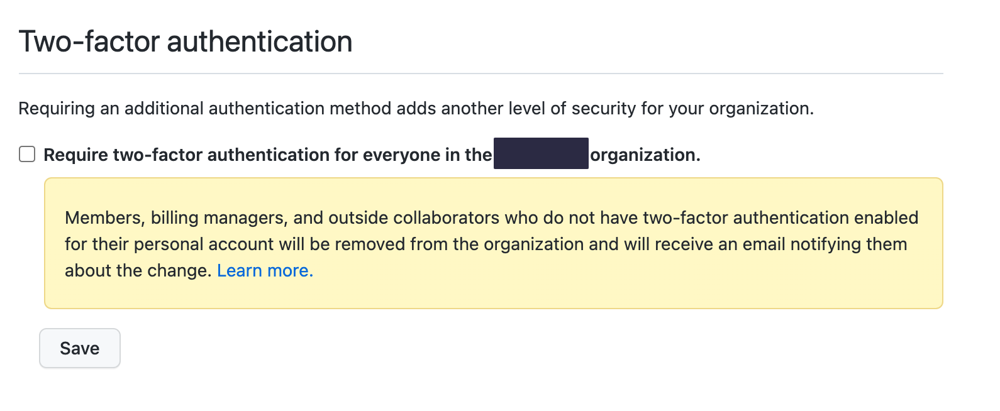

As a tech company, you're likely going to need somewhere to host and version control your source code. Unless you have specific requirements, you're likely to use a SaaS platform such as GitHub to do so. This article covers the main controls to implement on GitHub - but you'll find that most of these have equivalents on platforms such as [GitLab](https://about.gitlab.com/) or [BitBucket](https://bitbucket.org/product). This guide is meant for companies new to using GitHub, but the recommendations can be used for any organization using it.

| Description                                                                                                                                                                                                    | Label |
| -------------------------------------------------------------------------------------------------------------------------------------------------------------------------------------------------------------- | ----- |
| Everyone should do this                                                                                                                                 | 🍩     |
| Slight need for increased security                                                                                                                              | 🌯     |
| For those that will operate infra supporting systems that are critical | 🌶     |
| Recommendations that require the Enterprise version | 💰 | 

## Authentication
Authentication is the lynchpin of security on SaaS applications such as GitHub. 

GitHub authentication differs to many SaaS products in one important way: accounts are global. Developers can and do carry their accounts from company to company and use them for open source projects.

### Require two-factor authentication for everyone in the organization 🍩

The first thing you should do to your new GitHub organization is to enable two-factor authentication. Even if you plan to use Single Sign-On (SSO) with an identity provider that requires SSO, that will protect access to your organization, but 2FA is needed to protect the user account itself.

### Single Sign-On (SSO) 🌯💰
A question I hear frequently when companies are setting up their GitHub is 
> Should we ask our employees to create new, work GitHub accounts?

The answer to that is almost always **no**, due to a simple feature. If the goal is to make sure data does not get leaked to personal GitHub accounts, it is much easier to **use SSO authentication** for access to the organization, and require an email **on your corporate domain** for notifications related to your projects.

That way, your corporate GitHub notifications  are accessible on work email, and GitHub sessions themselves, with SAML.

The main downside of leveraging SSO on GitHub is that the price jumps from $4 per user/month to **$21**. They're not going to give up their rankings on [sso.tax](https://sso.tax/) soon.

0. Go to the *Organization Security* settings page.
1. Enable SSO **INSERTSCREENSHOTS**
2. **Require** SSO **INSERTSCREENSHOTS**
3. Go to the *Verified & approved domains* settings page
4. Verify your domain(s)
5. Require that email notifications only be sent to approved or verified domains. **INSERTSCREENSHOTS**

### Administrator Privileges 🌯

## Repositories

### Member Repository Permissions 🌯

### Repository Creation 🌯

### Repository Outside collaborators 🌯

### Admin Repository Permissions 

#### Allow members to change repository visibilities for this organization 🌯

#### Repository deletion and transfer 
#### Member team permissions
#### Member organization permissions

### Branch Protection

## Automation

### User and Team Management

### Repo Management

## Security & Analysis

## Actions

## Codespaces